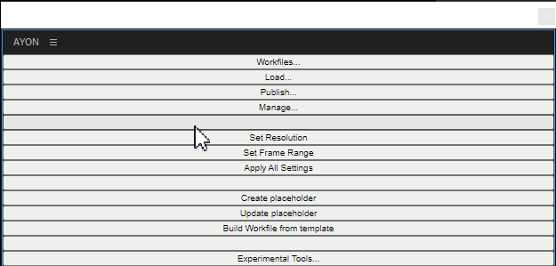

# AfterEffects Integration

Requirements: This extension requires use of Javascript engine, which is
available since CC 16.0.
Please check your File>Project Settings>Expressions>Expressions Engine

## Setup

The After Effects integration requires two components to work; `extension` and `server`.

### Extension

To install the extension download [Extension Manager Command Line tool (ExManCmd)](https://github.com/Adobe-CEP/Getting-Started-guides/tree/master/Package%20Distribute%20Install#option-2---exmancmd).

```
ExManCmd /install {path to addon}/api/extension.zxp
```
OR
download [Anastasiy’s Extension Manager](https://install.anastasiy.com/)

`{path to addon}` will be most likely in your AppData (on Windows, in your user data folder in Linux and MacOS.)

### Server

The easiest way to get the server and After Effects launch is with:

```
python -c ^"import ayon_core.hosts.photoshop;ayon_core.hosts.aftereffects.launch(""c:\Program Files\Adobe\Adobe After Effects 2020\Support Files\AfterFX.exe"")^"
```

`avalon.aftereffects.launch` launches the application and server, and also closes the server when After Effects exists.

## Usage

The After Effects extension can be found under `Window > Extensions > AYON`. Once launched you should be presented with a panel like this:




## Developing

### Extension
When developing the extension you can load it [unsigned](https://github.com/Adobe-CEP/CEP-Resources/blob/master/CEP_9.x/Documentation/CEP%209.0%20HTML%20Extension%20Cookbook.md#debugging-unsigned-extensions).

When signing the extension you can use this [guide](https://github.com/Adobe-CEP/Getting-Started-guides/tree/master/Package%20Distribute%20Install#package-distribute-install-guide).

```
ZXPSignCmd -selfSignedCert NA NA Ayon Avalon-After-Effects Ayon extension.p12
ZXPSignCmd -sign {path to addon}/api/extension {path to addon}/api/extension.zxp extension.p12 Ayon
```

### Plugin Examples

These plugins were made with the [polly config](https://github.com/mindbender-studio/config). To fully integrate and load, you will have to use this config and add `image` to the [integration plugin](https://github.com/mindbender-studio/config/blob/master/polly/plugins/publish/integrate_asset.py).

Expected deployed extension location on default Windows:
`c:\Program Files (x86)\Common Files\Adobe\CEP\extensions\io.ynput.AE.panel`

For easier debugging of Javascript:
https://community.adobe.com/t5/download-install/adobe-extension-debuger-problem/td-p/10911704?page=1
Add (optional) --enable-blink-features=ShadowDOMV0,CustomElementsV0 when starting Chrome
then localhost:8092

Or use Visual Studio Code https://medium.com/adobetech/extendscript-debugger-for-visual-studio-code-public-release-a2ff6161fa01
## Resources
  - https://javascript-tools-guide.readthedocs.io/introduction/index.html
  - https://github.com/Adobe-CEP/Getting-Started-guides
  - https://github.com/Adobe-CEP/CEP-Resources
